# Trimora — AI Video Intelligence Pipeline

[](https://opensource.org/licenses/MIT)
[](https://python.org)
[](https://docs.docker.com/compose/)
[](http://makeapullrequest.com)

**Trimora** is an AI-powered vertical video generator — it transforms long YouTube videos or local uploads into viral-ready short clips (9:16 format) for TikTok, Instagram Reels, and YouTube Shorts.

The project has two major components:

- **`engine/`** — A modular, rules-first video intelligence pipeline (Python)
- **`app/` + `dashboard/`** — A full-stack web application with FastAPI backend and React frontend

---

## Table of Contents

- [Engine Pipeline Overview](#engine-pipeline-overview)
- [Architecture](#architecture)
- [Pipeline Stages](#pipeline-stages)
- [Folder Structure](#folder-structure)
- [Rule System](#rule-system)
- [Knowledge Graph](#knowledge-graph)
- [Pattern Intelligence](#pattern-intelligence)
- [Confidence & Routing](#confidence--routing)
- [Scoring](#scoring)
- [LLM Teacher](#llm-teacher)
- [Quick Start (Engine)](#quick-start-engine)
- [Quick Start (Docker)](#quick-start-docker)
- [Configuration](#configuration)
- [API Endpoints](#api-endpoints)
- [Frontend Dashboard](#frontend-dashboard)
- [Tech Stack](#tech-stack)
- [Environment Variables](#environment-variables)
- [Features](#features)
- [Who Is This For?](#who-is-this-for)
- [Contributing](#contributing)
- [License](#license)

---

## Engine Pipeline Overview

The engine is a **14-stage, rules-first video processing pipeline** that transcribes, segments, analyzes, and scores video content to identify the best 45–90 second clips for short-form platforms. It uses a **cascading confidence system** to decide whether to use local rules, patterns, or LLM calls at each stage — minimizing API costs while maximizing quality.

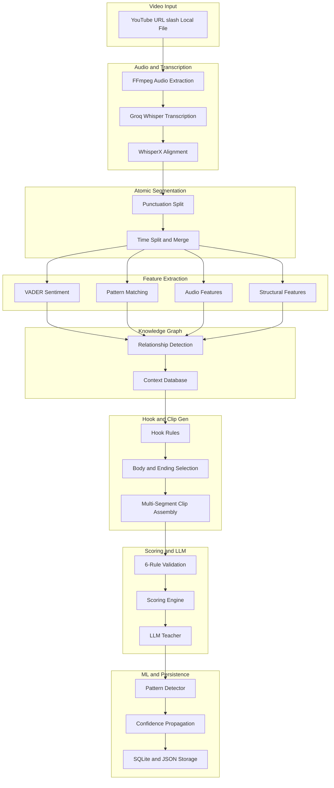

---

## Architecture

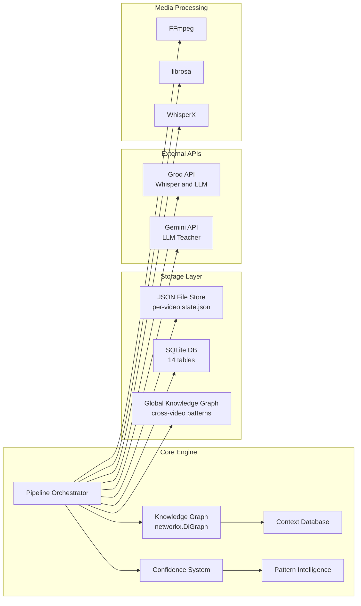

---

## Pipeline Stages


| Stage | Name | Description | Key Files |
|-------|------|-------------|-----------|
| 01 | Audio Extraction | FFmpeg extracts WAV (16kHz, mono) from video | `audio/extractor.py` |
| 02 | Quality Check | librosa measures SNR, speech rate, volume RMS | `audio/quality.py` |
| 03 | Chunking | Overlap chunking with pydub (30s/2s default) | `audio/chunker.py` |
| 04 | Transcription | Groq Whisper large-v3 API for each chunk | `transcription/transcriber.py` |
| 05 | Alignment | WhisperX word-level forced alignment | `transcription/aligner.py` |
| 06 | Segmentation | Punctuation + time-based atomic split; merge <2s | `segmentation/segmenter.py` |
| 07 | Features | VADER sentiment, 73 regex patterns, audio features, structural position | `features/` |
| 08 | Knowledge Graph | networkx DiGraph: follows, explains, contrasts, concludes, supports | `graph/` |
| 09 | Context DB | Tracks which segments need/provide context | `knowledge/context_db.py` |
| 10 | Hook Detection | 6 heuristic rules (energy, curiosity, contrast, etc.) | `rules/hook_rules.py` |
| 11 | Body/Ending Selection | Graph-connected body sequences + ending candidates | `rules/body_rules.py`, `rules/ending_rules.py` |
| 12 | Validation | 6 hard filters: duration, hook position, curiosity, value, speaker, context | `scoring/rule_engine.py` |
| 13 | Scoring | Weighted hook/body/ending + flow + uniqueness scores | `scoring/scorer.py` |
| 14 | LLM Label | (Optional) Groq/Gemini labels segments & candidates | `llm/teacher.py` |
| 15 | Persistence | SQLite + JSON per-video state storage | `data/` |
| 16+ | ML Learning | Pattern discovery, confidence propagation, global graph | `patterns/`, `confidence/` |

### Stage Details

#### 01–03: Audio Pipeline

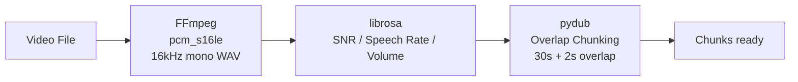

#### 04–05: Transcription & Alignment

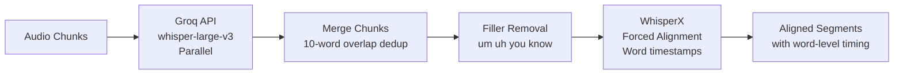

#### 06–07: Segmentation & Features

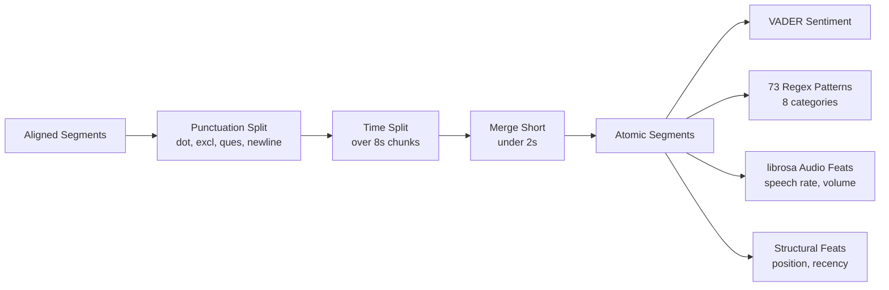

#### 08–09: Knowledge Graph

Segments are added to a `networkx.DiGraph` with typed, weighted edges:

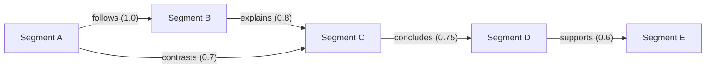

Edge types and detection:

| Edge Type | Detection | Weight Range |
|-----------|-----------|--------------|
| `follows` | Temporal adjacency | 1.0 |
| `explains` | Shared keywords + explanation regex | 0.7–0.9 |
| `contrasts` | Sentiment delta > 0.3 + contrast regex | 0.7–0.9 |
| `concludes` | Position > 50% + conclusion regex | 0.6–0.8 |
| `supports` | Shared keywords + support regex | 0.5–0.7 |

#### 10–12: Hook Detection & Clip Generation

```mermaid
flowchart LR
    KG[Knowledge Graph] --> HR[Hook Rules<br/>6 scoring rules]
    HR --> HC[Hook Candidates<br/>score > 50]
    HC --> BR[Body Rules<br/>graph + temporal]
    BR --> BS[Body Sequences<br/>chained by time]
    BS --> ER[Ending Rules<br/>takeaway + positive]
    ER --> EC[Ending Candidates]
    EC --> ASM[Assemble Clips<br/>hook + body_seq + ending]
    ASM --> VAL[6-Rule Validation]
    VAL --> ACCEPT[Accepted Clips]
```

#### 13–14: Scoring & LLM

Each accepted clip is scored on 6 dimensions:

```
Total Score = 0.35 × Hook + 0.25 × Body + 0.20 × Ending + 0.15 × Flow + 0.05 × Practicality + 0.05 × Uniqueness
```

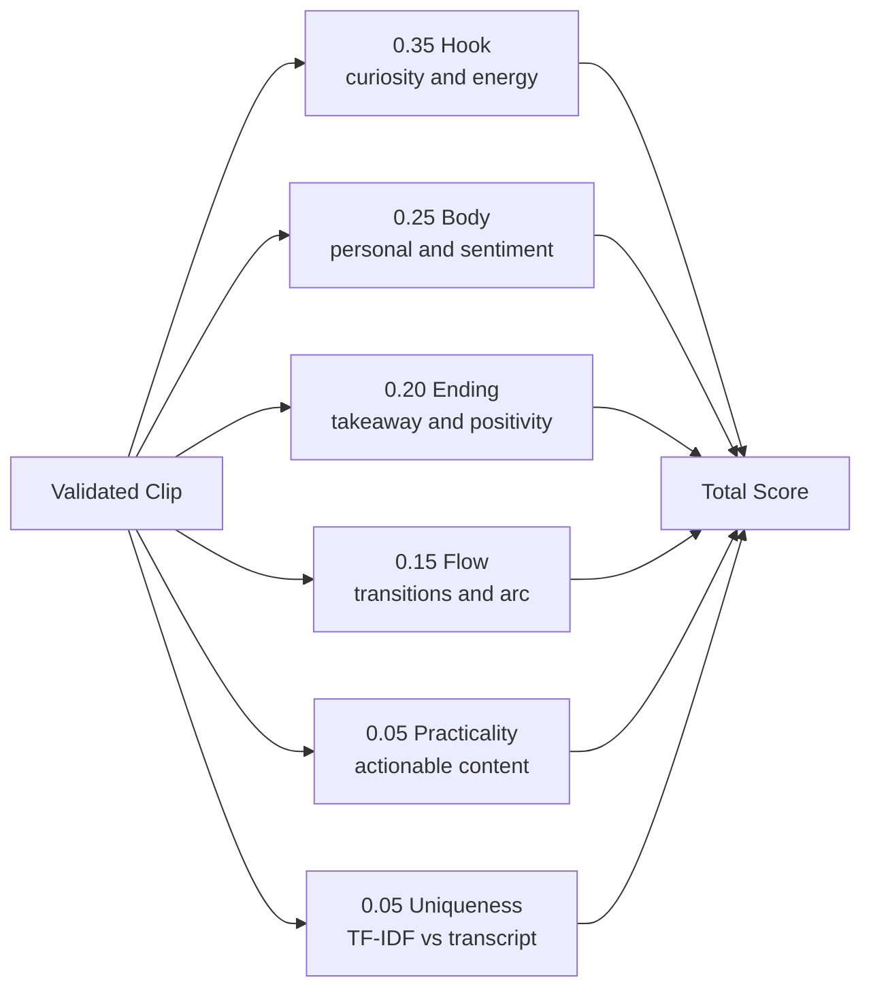

#### 15–16+: ML & Persistence

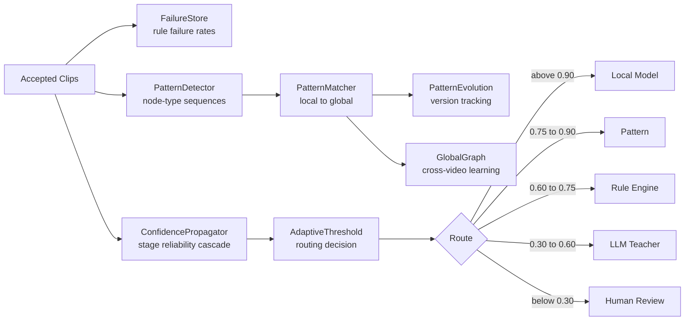

---

## Folder Structure

```
trimora/
│
├── engine/                          # Core video intelligence pipeline
│   ├── __init__.py
│   ├── config.py                    # 14-section dataclass config
│   ├── pipeline.py                  # 16-stage orchestrator with resume
│   ├── smoke_test.py                # Integration smoke test
│   │
│   ├── audio/                       # Audio extraction & analysis
│   │   ├── extractor.py             # FFmpeg WAV extraction
│   │   ├── quality.py               # SNR, speech rate, volume
│   │   └── chunker.py               # Overlap chunking (pydub)
│   │
│   ├── transcription/               # Speech-to-text
│   │   ├── transcriber.py           # Groq Whisper API
│   │   ├── aligner.py               # WhisperX word alignment
│   │   ├── merger.py                # Chunk merge + dedup
│   │   ├── fillers.py               # Filler word removal
│   │   └── language.py              # Language detection
│   │
│   ├── segmentation/                # Atomic segment splitting
│   │   └── segmenter.py             # Punctuation + time + merge
│   │
│   ├── features/                    # Content feature extraction
│   │   ├── sentiment.py             # VADER compound score
│   │   ├── patterns.py              # 73 regex patterns, 8 categories
│   │   ├── audio_features.py        # librosa onset/volume features
│   │   └── structural.py            # Position & recency
│   │
│   ├── graph/                       # Knowledge graph (v1)
│   │   ├── knowledge_graph.py       # networkx.DiGraph wrapper
│   │   └── relationships.py         # Edge type detection
│   │
│   ├── knowledge/                   # Knowledge graph (v2) + context
│   │   ├── local_graph.py           # Per-video graph
│   │   ├── global_graph.py          # Cross-video learning
│   │   ├── relationships.py         # Alternative edge detection
│   │   └── context_db.py            # Context requirement tracking
│   │
│   ├── rules/                       # Scoring & selection rules
│   │   ├── fundamentals.py          # Rule definitions & weights
│   │   ├── hook_rules.py            # Hook candidate scoring
│   │   ├── body_rules.py            # Body segment selection
│   │   ├── ending_rules.py          # Ending candidate scoring
│   │   └── stitching_rules.py       # Clip diversity scoring
│   │
│   ├── scoring/                     # Clip generation & scoring
│   │   ├── candidate_generator.py   # Multi-body clip assembly
│   │   ├── scorer.py                # Weighted 6-dim scoring
│   │   └── rule_engine.py           # 6 hard filter validation
│   │
│   ├── llm/                         # LLM teacher integration
│   │   ├── teacher.py               # Groq/Gemini API wrappers
│   │   ├── prompts.py               # 3 prompt templates
│   │   └── label_schemas.py         # Output dataclasses
│   │
│   ├── patterns/                    # ML pattern intelligence
│   │   ├── engine.py                # Orchestrator
│   │   ├── detector.py              # Pattern discovery
│   │   ├── matcher.py               # Local → global matching
│   │   ├── graph.py                 # Versioned pattern storage
│   │   ├── embeddings.py            # Cosine similarity search
│   │   ├── confidence.py            # Freshness decay
│   │   ├── context.py               # Context-aware analysis
│   │   └── meta.py                  # Meta-pattern graph
│   │
│   ├── confidence/                  # Adaptive routing
│   │   ├── scorer.py                # Cascading confidence
│   │   └── threshold.py             # 5-level routing matrix
│   │
│   ├── decision/                    # Decision tracking
│   │   ├── log.py                   # DecisionLog + DecisionEntry
│   │   ├── failures.py              # FailureStore + rule rates
│   │   └── tracker.py               # ClipTracker + history
│   │
│   └── data/                        # Storage & models
│       ├── models.py                # 18+ dataclasses
│       ├── storage.py               # SQLite (14 tables)
│       ├── migrations.py            # v1-v5 schema migrations
│       └── local_store.py           # JSON file per video
│
├── app.py                           # FastAPI server (Trimora.app)
├── main.py                          # Standalone CLI pipeline
├── editor.py                        # AI video effects (Gemini)
├── hooks.py                         # Text overlay rendering
├── subtitles.py                     # SRT + ASS subtitle generation
│
├── dashboard/                       # React frontend
│   ├── src/
│   │   ├── App.jsx                  # Main app component
│   │   ├── Landing.jsx              # Marketing landing page
│   │   ├── Legal.jsx                # Terms & Privacy
│   │   ├── main.jsx                 # Root with hash routing
│   │   ├── components/
│   │   │   ├── KeyInput.jsx         # API key manager
│   │   │   ├── MediaInput.jsx       # YouTube/upload input
│   │   │   ├── ResultCard.jsx       # Clip display
│   │   │   ├── HookModal.jsx        # Text overlay config
│   │   │   └── ProcessingAnimation.jsx  # Animated processing
│   │   ├── remotion/                # Remotion compositions
│   │   │   ├── compositions/
│   │   │   │   ├── ShortVideo.tsx   # Main composition
│   │   │   │   ├── Subtitles.tsx    # Animated subtitles
│   │   │   │   ├── HookOverlay.tsx  # Hook text animation
│   │   │   │   └── VideoEffects.tsx # Zoom/color effects
│   │   │   └── lib/
│   │   │       ├── types.ts         # TypeScript interfaces
│   │   │       ├── fonts.ts         # Font management
│   │   │       └── captions.ts      # Caption block grouping
│   │   └── lib/
│   │       └── renderInBrowser.js   # Remotion browser render
│   └── package.json
│
├── docker-compose.yml                # 3 services (backend, frontend, renderer)
├── Dockerfile                        # Multi-stage Python build
├── requirements.txt                  # Production deps
├── requirements_engine.txt           # Engine-only deps
├── engine_config.yaml                # Runtime config overrides
├── .env.example                      # Environment template
└── .gitignore
```

---

## Rule System

### 6 Hard Filters (Validation Gates)

All 6 must pass for a clip to be accepted:

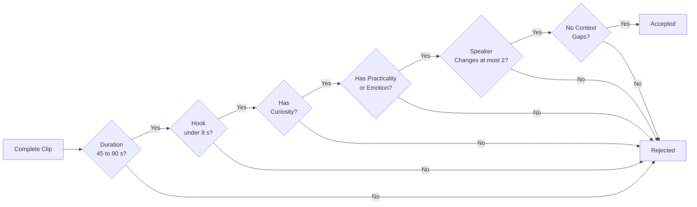

| Rule | Description | Config |
|------|-------------|--------|
| `total_duration_45_to_90` | Sum of all segment durations in [45, 90]s | `CLIP_MIN_DURATION` / `CLIP_MAX_DURATION` |
| `hook_in_first_5_seconds` | Hook segment ≤ 8s | `HOOK_MAX_DURATION` |
| `has_curiosity` | ≥1 segment with curiosity pattern | Pattern list |
| `has_practicality_or_emotion` | ≥1 practicality pattern OR \|sentiment\| > 0.3 | Pattern list |
| `max_2_speaker_changes` | ≤2 speaker transitions | Hardcoded |
| `no_context_gaps` | No context-reference phrases (e.g. "as I said") | Regex list |

### Hook Scoring Rules

| Rule | Weight | Condition |
|------|--------|-----------|
| `high_speech_rate` | 20 | Speech rate > 2.0 |
| `high_volume` | 15 | Volume delta > 1.5 |
| `curiosity` | 25 | Has what_if / unknown / biggest / question / unexpected pattern |
| `problem_statement` | 20 | Negative sentiment + personal pattern |
| `contrast` | 15 | Has but / however / surprisingly pattern |
| `energy_escalation` | +25 (bonus) | High volume + high speech rate combined |

### Ending Scoring Rules

| Rule | Weight | Condition |
|------|--------|-----------|
| `ENDING_POSITIVE` | 25 | Sentiment > 0.2 |
| `ENDING_TAKEAWAY` | 30 | Has key_lesson / action / point / here_is pattern |
| `ENDING_SUMMARY` | 20 | Has finally / so / conclusion pattern |
| `ENDING_DURATION_FIT` | 15 | 5–10 seconds |
| `ENDING_RECENCY` | 20 | Position > 70% of video |
| `ENDING_PRACTICALITY` | 25 | Has steps / lesson / framework pattern |
| `ENDING_RELATABLE` | 10 | Has personal pattern |
| `ENDING_RESOLUTION_BONUS` | 30 | Positive + takeaway + personal combined |

### 73 Regex Patterns (8 Categories)

| Category | Patterns | Examples |
|----------|----------|----------|
| `curiosity` | 7 | what_if, question, biggest, unknown, imagine |
| `story` | 8 | then, after, before, suddenly, finally |
| `practicality` | 7 | steps, framework, tip, rule, lesson |
| `shareability` | 7 | percentage, money, surprise, authority |
| `contrast` | 6 | but, however, actually, surprisingly, yet |
| `relatability` | 5 | personal, universal, engaging, empathy |
| `takeaway` | 7 | key_lesson, action, remember, point, here_is |
| `power_words` | 8 | secret, shocking, never, guaranteed |

---

## Knowledge Graph

The engine maintains **two parallel graph systems** for relationship tracking:

### Per-Video Knowledge Graph (`graph/knowledge_graph.py`)

Uses `networkx.DiGraph` to model relationships between segments within a single video:

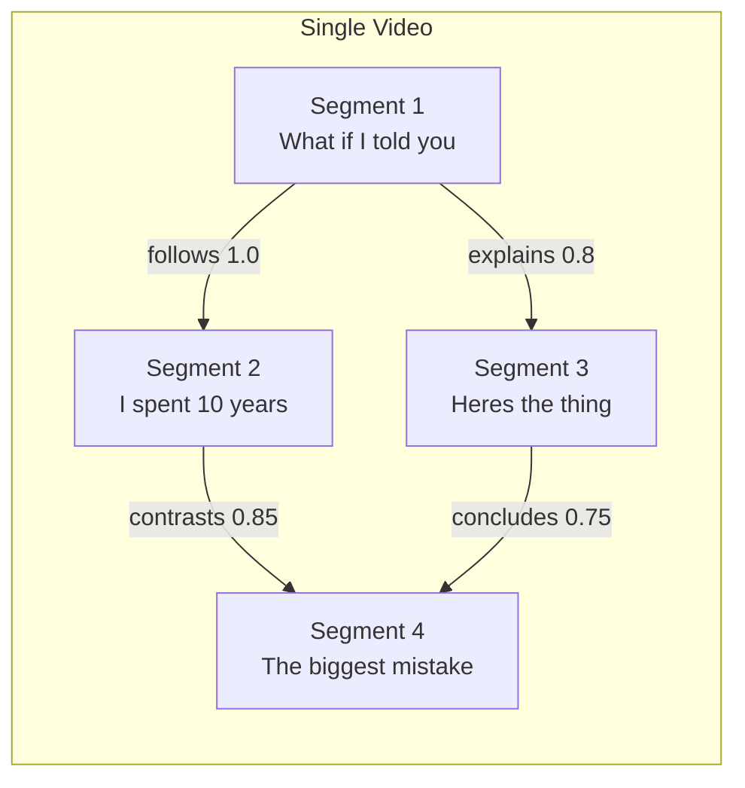

### Global Knowledge Graph (`knowledge/global_graph.py`)

Cross-video pattern learning for node-type → node-type transitions. Tracks averages for watch time, saves, shares, and emotion:

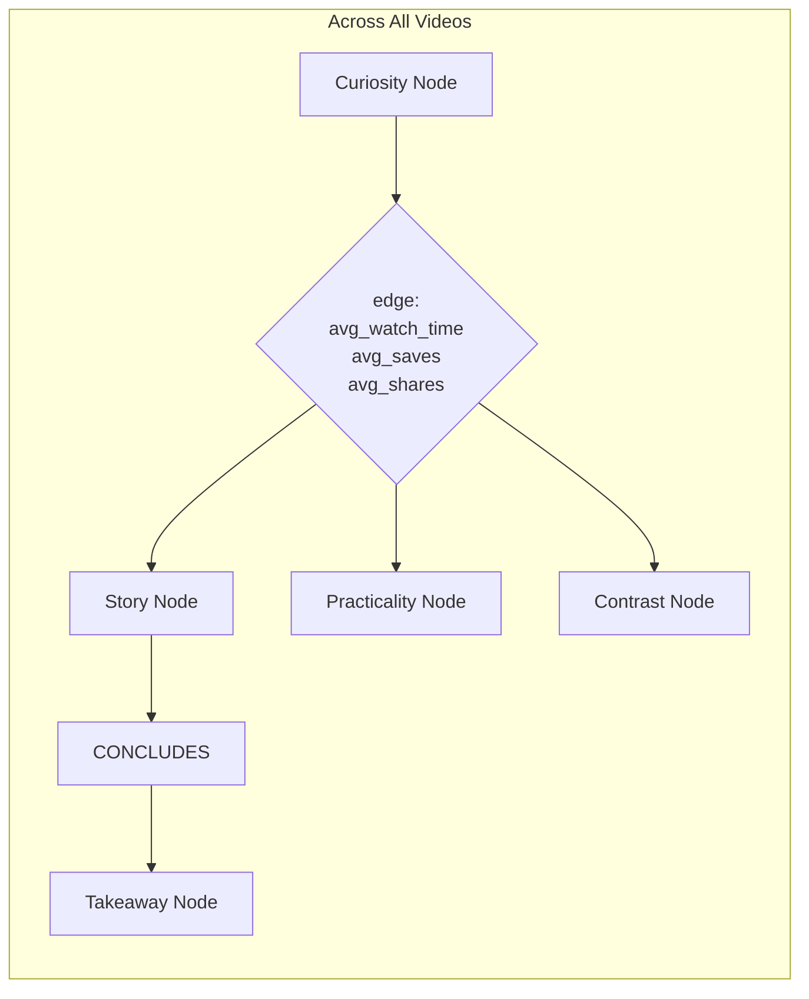

### Context Database (`knowledge/context_db.py`)

Tracks which segments need context vs. provide it:

| Context Type | Expression | Standalone Probability |
|--------------|------------|----------------------|
| `needs_context` | "as I said, going back to, like I mentioned" | 0.1–0.2 |
| `creates_context` | "what if, imagine if, here's the thing" | 0.8 |
| `standalone_ok` | "the key takeaway, the point is, in summary" | 0.9 |

---

## Pattern Intelligence

The pattern system discovers **recurring node-type sequences** across clips and learns which structures perform best.

### Pattern Discovery

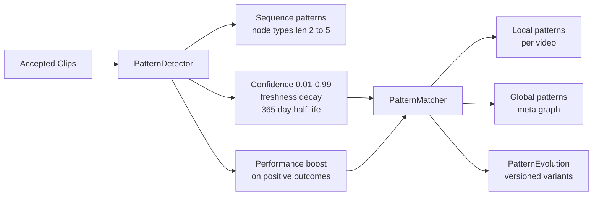

### Pattern Versions & Evolution

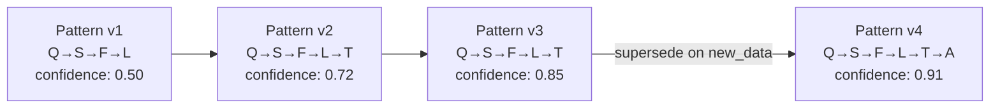

### Meta Pattern Graph

Tracks preferred structures by video **category** (e.g., business, tech, entertainment, education):

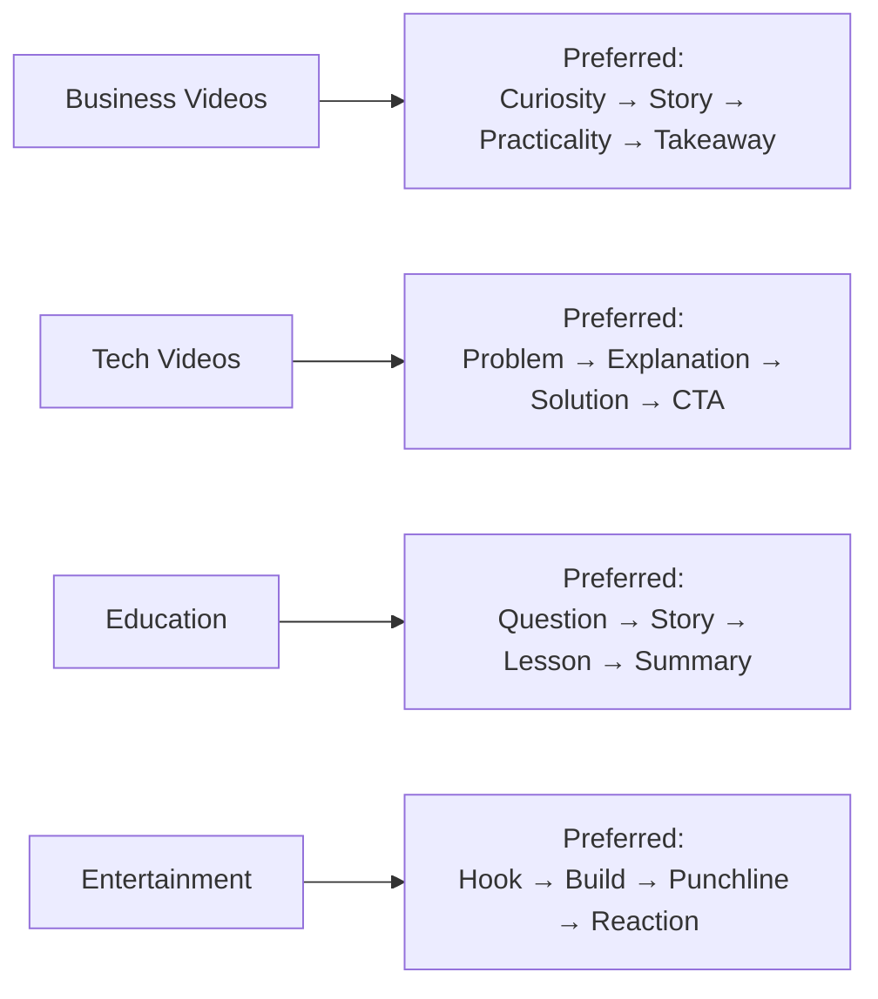

### Pattern Storage (SQLite Tables)

| Table | Purpose |
|-------|---------|
| `pattern_nodes` | Node-level stats per pattern occurrence |
| `pattern_edges` | Edge weights and transition probabilities |
| `meta_patterns` | Category-specific pattern preferences |

---

## Confidence & Routing

The engine uses a **cascading confidence system** to decide how to process each stage — minimizing API calls while maintaining quality.

### Confidence Propagation

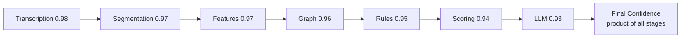

Formula: `confidence_final = ∏(stage_reliability[i])` for all completed stages.

### Adaptive Routing Matrix

| Confidence | Route | When |
|------------|-------|------|
| ≥ 0.90 | **Local Model** | High confidence — skip LLM |
| 0.75–0.90 | **Pattern Match** | Use discovered patterns |
| 0.60–0.75 | **Rule Engine** | Default: rules-first |
| 0.30–0.60 | **LLM Teacher** | Fall back to LLM |
| < 0.30 | **Human Review** | Too uncertain |

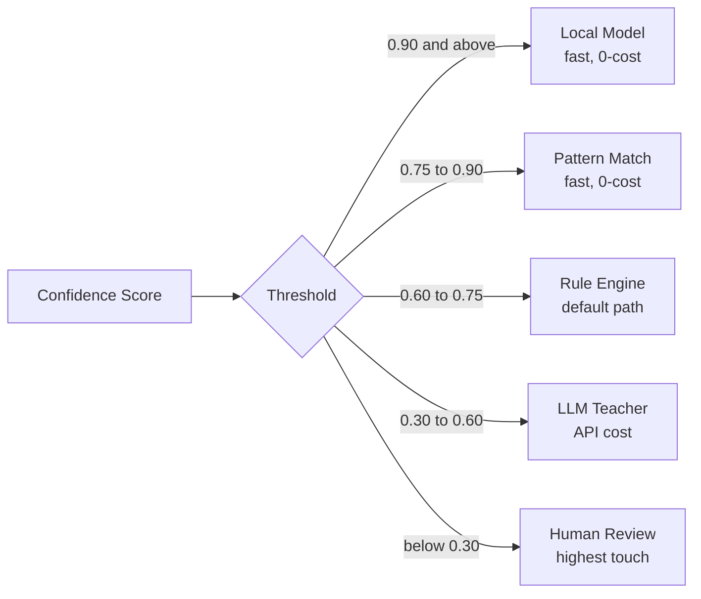

### Feature Provenance

Each feature records its origin for debugging and confidence calibration:

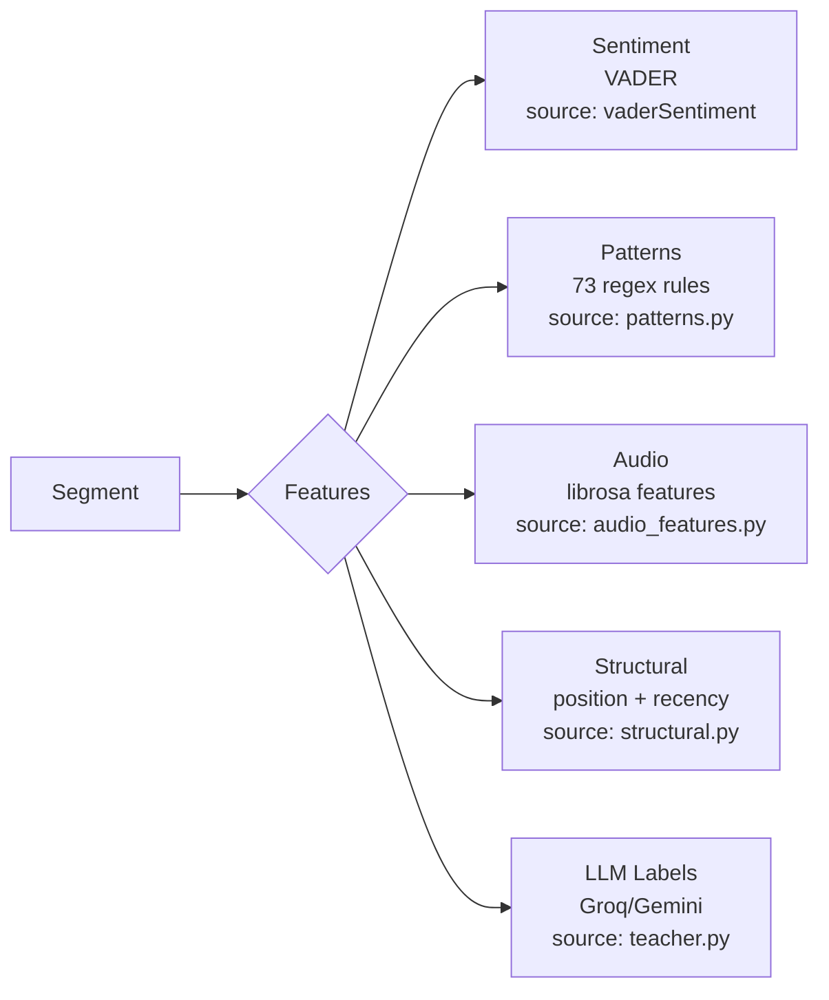

Stored in `feature_provenance` table for debugging and feature engineering.

---

## Scoring

### Final Score Formula

```
Total = 0.35 × hook_score + 0.25 × body_score + 0.20 × ending_score + 0.15 × flow_score + 0.05 × practicality + 0.05 × uniqueness
```

### Hook Score (0.35 weight)

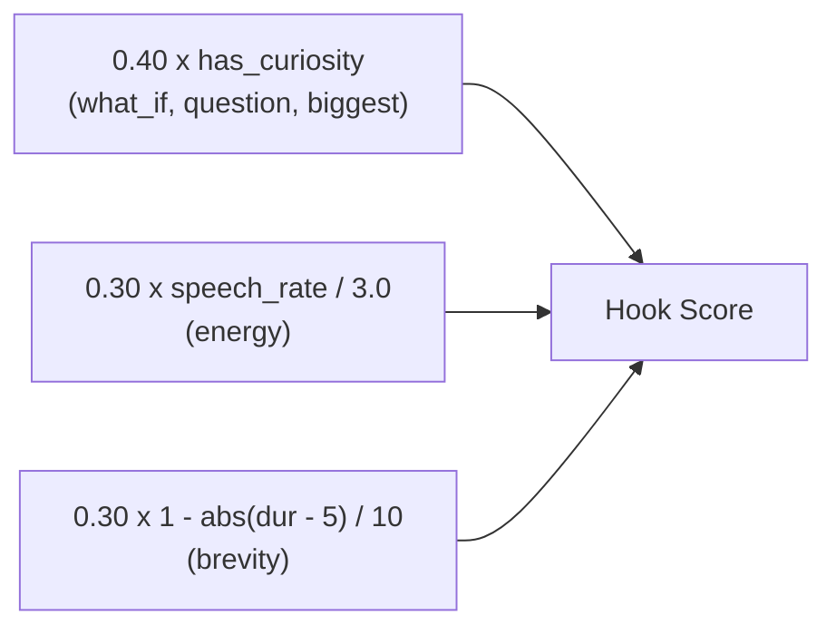

### Body Score (0.25 weight, averaged across all body segments)

```mermaid
flowchart LR
    B1["0.30 x has_personal<br/>(relatability)"]
    B2["0.30 x abs(sentiment) over 0.2<br/>(emotional weight)"]
    B3["0.40 x duration under 12s<br/>(pacing)"]
    B1 --> B_SEG[Per-Segment Score]
    B2 --> B_SEG
    B3 --> B_SEG
    B_SEG --> B_AVG[Average to Body Score]
```

### Ending Score (0.20 weight)

```mermaid
flowchart LR
    E1["0.30 x sentiment<br/>(positive resolution)"]
    E2["0.40 x has_takeaway<br/>(lesson or key lesson)"]
    E3["0.30 x 1 - abs(dur - 7) / 10<br/>(length fit)"]
    E1 --> E_TOTAL["Ending Score"]
    E2 --> E_TOTAL
    E3 --> E_TOTAL
```

### Flow Score (0.15 weight)

```mermaid
flowchart LR
    F1["0.30 x hook to body gap under 2s<br/>(tight transition)"]
    F2["0.30 x body to ending gap under 3s<br/>(smooth segue)"]
    F3["0.40 x has_emotional_arc<br/>(tension arc)"]
    F1 --> F_TOTAL["Flow Score"]
    F2 --> F_TOTAL
    F3 --> F_TOTAL
```

### Uniqueness Score (0.05 weight)

TF-IDF based: measures how rare the clip's words are within the full transcript.

```mermaid
flowchart LR
    TRANS[Full Transcript] --> FREQ[Word Frequencies<br/>Counter]
    CLIP[Clip Text] --> WORDS[Clip Words]
    FREQ --> IDF[IDF per word<br/>log N over freq]
    WORDS --> IDF
    IDF --> AVG[Average IDF]
    AVG --> UNIQ[avg_idf over 3 capped 1.0]
```

---

## LLM Teacher

The LLM teacher can use either **Groq** or **Gemini** (configured via `PROVIDER` in config). It provides three labeling operations:

### Segment Labeling

14 analysis dimensions per segment:

| Dimension | Description |
|-----------|-------------|
| `is_hook` | Could this be a hook? |
| `hook_type` | curiosity / problem / energy / contrast |
| `emotional_tone` | Positive / Negative / Neutral / Mixed |
| `emotional_intensity` | 0.0–1.0 |
| `narrative_role` | hook / build-up / climax / resolution / filler |
| `practical_value` | actionable advice / tip / lesson? |
| `target_audience` | beginner / intermediate / expert / general |
| `context_dependency` | standalone / needs_context / provides_context |
| `shareability` | 0.0–1.0 |
| `key_topics` | List of topic keywords |
| `speaker_intent` | inform / persuade / entertain / inspire |
| `viral_potential` | low / medium / high |
| `best_platform` | tiktok / reels / shorts / any |
| `suggested_hook_text` | Short attention-grabbing text |

### Candidate Labeling

11 dimensions for scoring candidate clips:

| Dimension | Description |
|-----------|-------------|
| `hook_quality` | 0.0–1.0 |
| `body_coherence` | 0.0–1.0 |
| `ending_quality` | 0.0–1.0 |
| `emotional_arc` | 0.0–1.0 |
| `context_completeness` | 0.0–1.0 |
| `practical_value` | 0.0–1.0 |
| `entertainment_value` | 0.0–1.0 |
| `shareability` | 0.0–1.0 |
| `platform_fit` | tiktok / reels / shorts / any |
| `suggested_hook_text` | Hook overlay suggestion |
| `estimated_viral_score` | 0.0–1.0 |

### Rejection Analysis

Why a clip was rejected — for continuous improvement via the `FailureStore`.

---

## Quick Start (Engine)

```bash
# 1. Clone
git clone https://github.com/your-username/Trimora.git
cd Trimora

# 2. Install engine dependencies
pip install -r requirements_engine.txt

# 3. Set your API key
set GROQ_API_KEY=gsk_your_key_here

# 4. Run smoke test
python -c "exec(open('engine/smoke_test.py').read())"

# 5. Run full integration test
python -c "
import os; os.environ['GROQ_API_KEY'] = 'test'
from engine.config import get_config
cfg = get_config()
cfg.llm.USE_LLM = False

# Import and run pipeline components
from engine.segmentation.segmenter import split_into_atomic_segments
from engine.features.sentiment import compute_sentiment
from engine.features.patterns import match_patterns
from engine.graph.knowledge_graph import KnowledgeGraph
from engine.graph.relationships import detect_relationships
from engine.rules.hook_rules import find_hook_candidates
from engine.scoring.candidate_generator import generate_candidates
from engine.scoring.rule_engine import validate_clip
from engine.scoring.scorer import make_valid_clip, score_clip

# ... see engine/smoke_test.py for full example
"
```

### Using the Pipeline Orchestrator

```python
from engine.pipeline import Pipeline

pipeline = Pipeline(
    video_path="path/to/video.mp4",
    video_id="my-video-001"
)
result = pipeline.run()
print(f"Generated {len(result['clips'])} clips")
```

---

## Quick Start (Docker)

```bash
# 1. Configure
cp .env.example .env

# 2. Launch all services
docker compose up --build

# 3. Open dashboard
# Navigate to http://localhost:5175
```

Services:

| Service | Port | Description |
|---------|------|-------------|
| Backend | `8000` | FastAPI server |
| Frontend | `5175` | Vite React dashboard |
| Renderer | `3100` | Remotion video renderer |

---

## Configuration

### `engine/config.py` (14 Sections)

| Section | Class | Key Parameters |
|---------|-------|----------------|
| Audio | `AudioConfig` | sample_rate, channels, format |
| Quality | `QualityConfig` | SNR threshold, speech rate threshold |
| Chunking | `ChunkingConfig` | chunk size, overlap, fade |
| Transcription | `TranscriptionConfig` | groq_model, temperature, retry |
| Alignment | `AlignmentConfig` | whisperx device, batch size |
| Segmentation | `SegmentationConfig` | max_segment_duration (8s), min (2s) |
| Scoring | `ScoringConfig` | clip min/max duration, weights |
| Rule Scores | `RuleScoreConfig` | per-rule weights for hooks/body/ending |
| Graph | `GraphConfig` | edge weights, temporal window |
| Confidence | `ConfidenceConfig` | stage reliability values |
| Pattern | `PatternConfig` | decay rate, half-life, thresholds |
| Storage | `StorageConfig` | store root paths |
| LLM | `LLMConfig` | provider, model, temperature |
| Pipeline | `PipelineConfig` | concurrency, resume, cleanup |

### `engine_config.yaml` (Runtime Overrides)

```yaml
# engine_config.yaml — overrides config.py defaults at runtime
llm:
  use_llm: true
  provider: groq          # "groq" or "gemini"
  groq_model: llama-3.3-70b-versatile

scoring:
  clip_min_duration: 45.0
  clip_max_duration: 90.0

pipeline:
  resume_enabled: true
  max_concurrent_jobs: 5
```

Load at runtime:

```python
from engine.config import load_config_from_yaml
cfg = load_config_from_yaml("engine_config.yaml")
```

## API Endpoints

### Legacy App (FastAPI — `app.py`)

| Method | Route | Purpose |
|--------|-------|---------|
| POST | `/api/process` | Submit video for processing |
| GET | `/api/status/{job_id}` | Poll job status & logs |
| POST | `/api/edit` | AI video effects (Gemini) |
| POST | `/api/subtitle` | Generate & apply subtitles |
| POST | `/api/hook` | Add hook text overlays |
| POST | `/api/translate` | AI voice dubbing (ElevenLabs) |
| GET | `/api/translate/languages` | List dubbing languages |
| POST | `/api/social/post` | Post to social media |

### Engine Pipeline

The engine is a **Python library** — you call it directly or integrate via the pipeline orchestrator:

```python
from engine.pipeline import Pipeline

pipeline = Pipeline(
    video_path="input.mp4",
    video_id="unique-id",
    groq_api_key="gsk_...",
    whisperx_device="cpu"
)
result = pipeline.run()
# result contains: clips, segments, patterns, confidence_score
```

---

## Frontend Dashboard

The React dashboard (`dashboard/`) provides:

- **Clip Generator**: Upload long videos → get short clips
- **AI Agent**: Configure the clip generation pipeline
- **Settings**: Manage API keys (stored encrypted in localStorage)
- **Video Processing**: Real-time animated processing preview
- **Clip Results**: Per-clip player with edit/download/hook overlay tools
- **Remotion Rendering**: Browser-based video compositing with subtitles, effects, and hook overlays

All API keys are encrypted client-side and never stored on the server.

---

## Tech Stack

| Layer | Technology |
|-------|-----------|
| **Engine Language** | Python 3.11 |
| **Engine Libraries** | networkx, librosa, pydub, vaderSentiment, sentence-transformers, aiosqlite |
| **Transcription** | Groq Whisper large-v3, WhisperX alignment |
| **LLM** | Groq (llama-3.3-70b), Gemini (via google-genai) |
| **Backend** | FastAPI, uvicorn, yt-dlp, FFmpeg |
| **Video Processing** | opencv-python, mediapipe, ultralytics (YOLOv8) |
| **Frontend** | React 18, Vite 4, Tailwind CSS 3.4 |
| **Video Rendering** | Remotion 4.0 |
| **Infrastructure** | Docker + Docker Compose, AWS S3 |

---

## Environment Variables

### Server-side (`.env`)

| Variable | Description |
|----------|-------------|
| `GROQ_API_KEY` | Groq API key (transcription + LLM) |
| `AWS_ACCESS_KEY_ID` | AWS access key for S3 |
| `AWS_SECRET_ACCESS_KEY` | AWS secret key |
| `AWS_REGION` | AWS region |
| `AWS_S3_BUCKET` | Private bucket for clip backup |
| `MAX_CONCURRENT_JOBS` | Concurrent processing limit (default: 5) |

### Client-side (encrypted in localStorage)

| Key | Description | Required For |
|-----|-------------|-------------|
| `GEMINI_API_KEY` | Google Gemini | AI features in web app |
| `ELEVENLABS_API_KEY` | ElevenLabs | Voice dubbing |
| `UPLOAD_POST_API_KEY` | Upload-Post | Social publishing |
| `FAL_KEY` | fal.ai | AI Shorts generation |

---

## Features

### Clip Generator (Legacy)
- **Viral Moment Detection**: Gemini AI analyzes transcripts + scene boundaries
- **Smart 9:16 Cropping**: TRACK mode (MediaPipe + YOLOv8) or GENERAL mode (blurred background)
- **Auto Subtitles**: faster-whisper with word-level timing, styled/burned in
- **AI Voice Dubbing**: ElevenLabs for 30+ languages
- **Hook Text Overlays**: Attention-grabbing text with animated entrance
- **AI Video Effects**: Gemini-generated FFmpeg filters

### Engine Pipeline
- **Rules-First Architecture**: 6 validation gates, 20+ scoring rules — minimizes LLM calls
- **Multi-Body Clips**: 7–18 segments per clip for proper 45–90s duration
- **Cascading Confidence**: 5-level routing (local → pattern → rule → LLM → human)
- **Pattern Intelligence**: Discovers recurring segment sequences across videos
- **Global Learning**: Cross-video knowledge graph improves over time
- **Resumable Pipeline**: Per-video `state.json` allows interrupted runs to skip completed stages
- **Rich SQLite Storage**: 14 tables for segments, patterns, decisions, words, relationships
- **Dual-Mode LLM**: Groq (default) or Gemini backend configurable at runtime
- **TF-IDF Uniqueness Scoring**: Rare words within the transcript boost clip score
- **Decision Tracking**: Every accepted/rejected candidate recorded for analytics

---

## Who Is This For?

- **Content creators** — Turn long videos into shorts automatically
- **Developers** — Integrate the engine pipeline into your own tools
- **AI/ML engineers** — Extend the pattern intelligence and confidence systems
- **SaaS founders** — Build vertical video products on top of this pipeline
- **Researchers** — Study rules-first vs LLM-first video analysis approaches

---

## Contributing

Contributions are welcome! Areas to contribute:

- **New LLM providers** (OpenAI, Anthropic, local models)
- **Additional pattern categories** for `features/patterns.py`
- **Improve edge detection** in `graph/relationships.py`
- **Add more validation rules** in `scoring/rule_engine.py`
- **Multi-language support** in transcription and segmentation
- **Web UI** for engine pipeline configuration and monitoring
- **Tests** — the engine needs comprehensive unit and integration tests
- **Performance** — optimize WhisperX alignment and audio feature extraction

```bash
# Before submitting a PR, ensure:
python -m py_compile engine/pipeline.py
python -m py_compile engine/config.py
# Run smoke test
python -c "exec(open('engine/smoke_test.py').read())"
```

---

## License

MIT License. Trimora is yours to use, modify, and scale.
