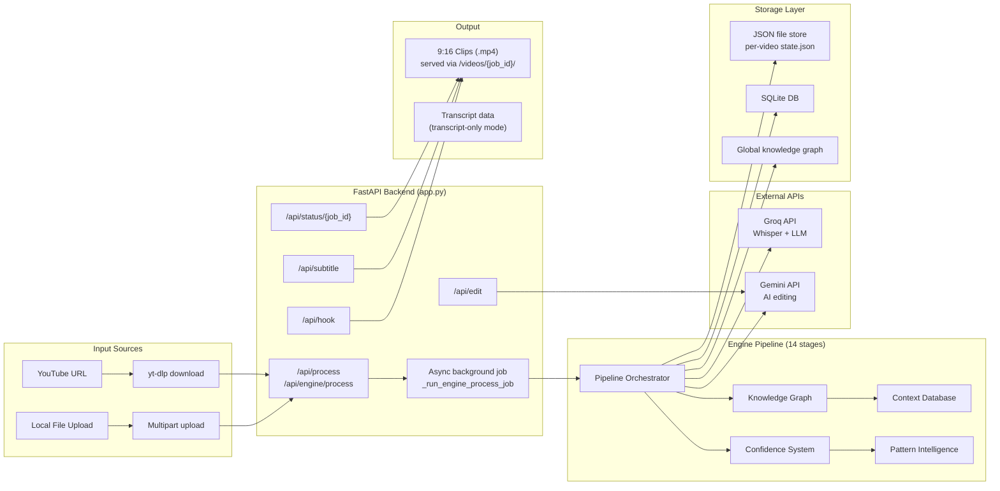
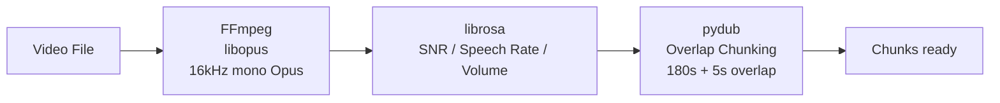
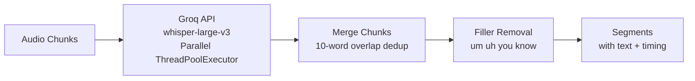
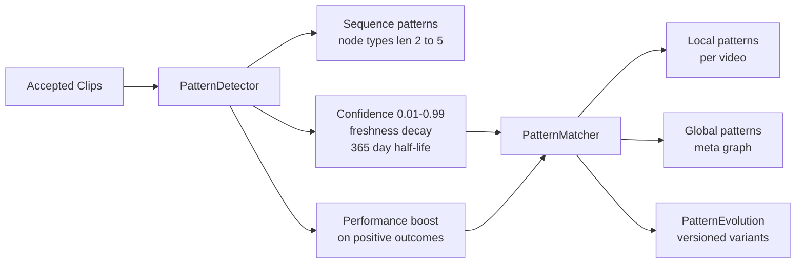

# OpenShorts (Trimora) — AI Vertical Short Generator

[](https://opensource.org/licenses/MIT)
[](https://python.org)
[](https://docs.docker.com/compose/)
[](http://makeapullrequest.com)

OpenShorts is an AI-powered vertical video generator — it transforms long YouTube videos or local uploads into viral-ready short clips (9:16 format) for TikTok, Instagram Reels, and YouTube Shorts.

The project has three major components:

- **`engine/`** — A modular, rules-first 14-stage video intelligence pipeline (Python)
- **`app.py`** — FastAPI web server with async background processing
- **`dashboard/`** — React + Vite frontend with Remotion rendering

---

## Table of Contents

- [Quick Start (Windows)](#quick-start-windows)
- [Quick Start (Docker)](#quick-start-docker)
- [Architecture](#architecture)
- [Pipeline Stages](#pipeline-stages)
- [Folder Structure](#folder-structure)
- [API Endpoints](#api-endpoints)
- [Internal Clip Processing](#internal-clip-processing)
- [Rule System](#rule-system)
- [Knowledge Graph](#knowledge-graph)
- [Pattern Intelligence](#pattern-intelligence)
- [Confidence & Routing](#confidence--routing)
- [Scoring](#scoring)
- [LLM Teacher](#llm-teacher)
- [Configuration](#configuration)
- [Frontend Dashboard](#frontend-dashboard)
- [Environment Variables](#environment-variables)
- [Features](#features)
- [Who Is This For?](#who-is-this-for)
- [Contributing](#contributing)
- [License](#license)

---

## Quick Start (Windows)

```powershell
# 1. Clone
git clone https://github.com/your-username/Trimora.git
cd Trimora

# 2. One-click launch (auto-installs everything)
.\start.bat
```

`start.bat` will:
1. Check for Python, Node.js, and FFmpeg (auto-downloads FFmpeg via `install-ffmpeg.ps1`)
2. Create a Python virtual environment in `venv/`
3. Install `requirements.txt` + `requirements_engine.txt`
4. Install `dashboard/` npm dependencies
5. Start **Backend**: `uvicorn app:app --host 0.0.0.0 --port 8000 --reload`
6. Start **Frontend**: `npm run dev` in `dashboard/`
7. Open `http://localhost:5173` (dashboard) and `http://localhost:8000` (API)

### Manual Backend

```bash
pip install -r requirements.txt
pip install -r requirements_engine.txt
set GROQ_API_KEY=gsk_your_key_here
uvicorn app:app --host 0.0.0.0 --port 8000 --reload
```

### Manual Frontend

```bash
cd dashboard
npm install
npm run dev
```

---

## Quick Start (Docker)

```bash
cp .env.example .env
docker compose up --build
```

| Service | Port | Description |
|---------|------|-------------|
| Backend | `8000` | FastAPI server |
| Frontend | `5175` | Vite React dashboard (maps to internal 5173) |
| Renderer | `3100` | Remotion video renderer |

---

## Architecture



### Data Flow

```
User uploads video / submits YouTube URL
        │
        ▼
  POST /api/engine/process
        │
        ├── Returns {job_id, status: "queued"}
        │
        ▼  (background)
  _run_engine_process_job()
        │
        ├── 1. Load engine_config.yaml
        ├── 2. If mode="transcript": transcribe only (Groq)
        ├── 3. If mode="full": Pipeline.run()
        │      14 stages (audio → transcription → clips)
        ├── 4. For top 10 candidates: _cut_and_convert_clip()
        │      FFmpeg cut + 9:16 conversion
        └── 5. Return clips with metadata
        │
        ▼
  GET /api/status/{job_id}   ◄── Poll until "completed"
        │
        ▼
  Results: video_urls, hook_text, scores
        │
        ├── POST /api/hook       → Add text overlay
        ├── POST /api/subtitle   → Burn subtitles
        └── POST /api/edit       → AI video effects (Gemini)
```

---

## Pipeline Stages

The engine is a **14-stage, rules-first video processing pipeline** that transcribes, segments, analyzes, and scores video content to identify the best 45–90 second clips for short-form platforms. It uses a **cascading confidence system** to decide whether to use local rules, patterns, or LLM calls at each stage — minimizing API costs while maximizing quality.


| Stage | Name | Description | Key Files |
|-------|------|-------------|-----------|
| 01 | Audio Extraction | FFmpeg extracts Opus (16kHz, mono) from video | `audio/extractor.py` |
| 02 | Quality Check | librosa measures SNR, speech rate, volume RMS | `audio/quality.py` |
| 03 | Chunking | Overlap chunking with pydub (180s / 5s overlap) | `audio/chunker.py` |
| 04 | Transcription | Groq Whisper large-v3 API — parallel via ThreadPoolExecutor | `transcription/transcriber.py` |
| 05 | Alignment | WhisperX word-level forced alignment (disabled by default — CPU bottleneck) | `transcription/aligner.py` |
| 06 | Segmentation | Punctuation + time-based atomic split; merge <2s | `segmentation/segmenter.py` |
| 07 | Features | VADER sentiment, 73 regex patterns, audio features, structural position | `features/` |
| 08 | Knowledge Graph | networkx DiGraph: follows, explains, contrasts, concludes, supports | `graph/`, `knowledge/` |
| 09 | Context DB | Tracks which segments need/provide context | `knowledge/context_db.py` |
| 10 | Hook Detection | 6 heuristic rules (energy, curiosity, contrast, etc.) | `rules/hook_rules.py` |
| 11 | Body/Ending | Graph-connected body sequences + ending candidates | `rules/body_rules.py`, `rules/ending_rules.py` |
| 12 | Validation | 6 hard filters: duration, hook position, curiosity, value, speaker, context | `scoring/rule_engine.py` |
| 13 | Scoring | Weighted hook/body/ending + flow + uniqueness scores | `scoring/scorer.py` |
| 14 | LLM Label | (Optional) Groq Llama labels segments & candidates | `llm/teacher.py` |
| 15 | Persistence | SQLite + JSON per-video state storage | `data/` |
| 16+ | ML Learning | Pattern discovery, confidence propagation, global graph | `patterns/`, `confidence/` |

### Stage Details

#### 01–03: Audio Pipeline



- **Audio format**: Opus (12k bitrate) — switched from WAV/pcm_s16le for smaller files
- **Parallel transcription**: Chunks transcribed simultaneously via `ThreadPoolExecutor` (worker count from config)

#### 04–05: Transcription & Alignment



WhisperX alignment is **disabled by default** (CPU bottleneck). To enable, set `align_segments` in `pipeline.py`.

---

## Folder Structure

```
openshorts/
│
├── app.py                           # FastAPI web server
├── main.py                          # Standalone CLI pipeline (legacy)
├── editor.py                        # AI video effects (Gemini)
├── subtitles.py                     # SRT + ASS subtitle generation
├── hooks.py                         # Hook text overlay rendering
│
├── engine/                          # Core video intelligence pipeline
│   ├── __init__.py
│   ├── config.py                    # 14-section dataclass config
│   ├── pipeline.py                  # 14-stage orchestrator with resume
│   ├── smoke_test.py                # Integration smoke test
│   │
│   ├── audio/                       # Audio extraction & analysis
│   │   ├── extractor.py             # FFmpeg Opus extraction
│   │   ├── quality.py               # SNR, speech rate, volume
│   │   └── chunker.py               # Overlap chunking (pydub)
│   │
│   ├── transcription/               # Speech-to-text
│   │   ├── transcriber.py           # Groq Whisper API
│   │   ├── aligner.py               # WhisperX word alignment
│   │   ├── merger.py                # Chunk merge + dedup
│   │   ├── fillers.py               # Filler word removal
│   │   └── language.py              # Language detection
│   │
│   ├── segmentation/                # Atomic segment splitting
│   │   ├── segmenter.py             # Punctuation + time + merge
│   │   └── test_debug.py / test_debug2.py
│   │
│   ├── features/                    # Content feature extraction
│   │   ├── sentiment.py             # VADER compound score
│   │   ├── patterns.py              # 73 regex patterns, 8 categories
│   │   ├── audio_features.py        # librosa onset/volume features
│   │   └── structural.py            # Position & recency
│   │
│   ├── graph/                       # Knowledge graph (v1)
│   │   ├── knowledge_graph.py       # networkx.DiGraph wrapper
│   │   └── relationships.py         # Edge type detection
│   │
│   ├── knowledge/                   # Knowledge graph (v2) + context
│   │   ├── local_graph.py           # Per-video graph
│   │   ├── global_graph.py          # Cross-video learning
│   │   ├── relationships.py         # Alternative edge detection
│   │   └── context_db.py            # Context requirement tracking
│   │
│   ├── rules/                       # Scoring & selection rules
│   │   ├── fundamentals.py          # Rule definitions & weights
│   │   ├── hook_rules.py            # Hook candidate scoring
│   │   ├── body_rules.py            # Body segment selection
│   │   ├── ending_rules.py          # Ending candidate scoring
│   │   └── stitching_rules.py       # Clip diversity scoring
│   │
│   ├── scoring/                     # Clip generation & scoring
│   │   ├── candidate_generator.py   # Multi-body clip assembly
│   │   ├── scorer.py                # Weighted 6-dim scoring
│   │   └── rule_engine.py           # 6 hard filter validation
│   │
│   ├── llm/                         # LLM teacher integration
│   │   ├── teacher.py               # Groq API wrappers
│   │   ├── prompts.py               # 3 prompt templates
│   │   └── label_schemas.py         # Output dataclasses
│   │
│   ├── patterns/                    # ML pattern intelligence
│   │   ├── engine.py                # Orchestrator
│   │   ├── detector.py              # Pattern discovery
│   │   ├── matcher.py               # Local → global matching
│   │   ├── graph.py                 # Versioned pattern storage
│   │   ├── embeddings.py            # Cosine similarity search
│   │   ├── confidence.py            # Freshness decay
│   │   ├── context.py               # Context-aware analysis
│   │   └── meta.py                  # Meta-pattern graph
│   │
│   ├── confidence/                  # Adaptive routing
│   │   ├── scorer.py                # Cascading confidence
│   │   └── threshold.py             # 5-level routing matrix
│   │
│   ├── decision/                    # Decision tracking
│   │   ├── log.py                   # DecisionLog + DecisionEntry
│   │   ├── failures.py              # FailureStore + rule rates
│   │   └── tracker.py               # ClipTracker + history
│   │
│   └── data/                        # Storage & models
│       ├── models.py                # 18+ dataclasses
│       ├── storage.py               # SQLite (14 tables)
│       ├── migrations.py            # v1-v5 schema migrations
│       ├── local_store.py           # JSON file per video
│       └── store/                   # Runtime data (SQLite DB, per-video state)
│
├── dashboard/                       # React frontend
│   ├── src/
│   │   ├── App.jsx                  # Main app component
│   │   ├── App.css
│   │   ├── index.css                # Tailwind directives
│   │   ├── main.jsx                 # Entry point
│   │   ├── Landing.jsx              # Marketing landing page
│   │   ├── Legal.jsx                # Terms & Privacy
│   │   ├── config.js                # API_BASE_URL configuration
│   │   │
│   │   ├── components/
│   │   │   ├── KeyInput.jsx         # Groq API key input
│   │   │   ├── MediaInput.jsx       # YouTube URL / file upload + mode toggle
│   │   │   ├── ResultCard.jsx       # Clip display with edit/download
│   │   │   ├── HookModal.jsx        # Hook text overlay config
│   │   │   └── ProcessingAnimation.jsx  # Animated processing preview
│   │   │
│   │   ├── remotion/                # Remotion compositions
│   │   │   ├── compositions/
│   │   │   │   ├── ShortVideo.tsx   # Main composition
│   │   │   │   ├── Subtitles.tsx    # Animated subtitles
│   │   │   │   ├── HookOverlay.tsx  # Hook text animation
│   │   │   │   └── VideoEffects.tsx # Zoom/color effects
│   │   │   └── lib/
│   │   │       ├── types.ts         # TypeScript interfaces
│   │   │       ├── fonts.ts         # Font management
│   │   │       └── captions.ts      # Caption block grouping
│   │   │
│   │   └── lib/
│   │       └── renderInBrowser.js   # Remotion browser render
│   │
│   └── package.json
│
├── remotion/                        # Standalone Remotion compositions
├── render-service/                  # Node.js Remotion rendering server (Express, port 3100)
│
├── ffmpeg/bin/                      # Local FFmpeg/FFprobe/FFplay binaries
├── fonts/                           # NotoSerif-Bold.ttf for hook overlays
├── uploads/                         # Uploaded video files
├── output/                          # Generated clip output (per-job UUID directories)
├── recordings/                      # Screen recordings (dev)
├── screenshots/                     # Demo screenshots
│
├── start.bat                        # One-click Windows launcher
├── install-ffmpeg.ps1              # Auto-downloads FFmpeg for Windows
├── engine_config.yaml               # Runtime config overrides
├── requirements.txt                 # Production deps
├── requirements_engine.txt          # Engine-only deps
├── Dockerfile                       # Multi-stage Python build
├── docker-compose.yml               # 3 services (backend, frontend, renderer)
├── .env.example                     # Environment template
├── .gitignore
└── LICENSE                          # MIT License
```

---

## API Endpoints

All endpoints served by `app.py` (FastAPI on port 8000).

### Processing

| Method | Path | Description |
|--------|------|-------------|
| POST | `/api/engine/process` | Submit video/URL for engine pipeline processing |
| POST | `/api/process` | Legacy processing endpoint (also routes to engine) |
| GET | `/api/status/{job_id}` | Poll job status, logs, and results |
| GET | `/api/config` | Returns `{"youtubeUrlEnabled": bool}` |
| GET | `/api/health` | Health check `{"status": "ok"}` |

**`/api/engine/process` parameters:**

| Parameter | Type | Description |
|-----------|------|-------------|
| `file` | File | Video file upload (alternative to URL) |
| `url` | string | YouTube URL (alternative to file) |
| `acknowledged` | boolean | Must be `true` — confirms content ownership |
| `category` | string | Video category (general / tech / business / etc.) |
| `mode` | string | `"full"` (default) — full pipeline, `"transcript"` — transcribe only |

**Headers:** `X-Groq-Key` (required), `X-Gemini-Key` (optional, for AI editing)

### Clip Post-Processing

| Method | Path | Description |
|--------|------|-------------|
| POST | `/api/edit` | AI video effects via Gemini. Requires `job_id`, `clip_index`, `X-Gemini-Key` |
| GET | `/api/clip/{job_id}/{clip_index}/transcript` | Returns clip captions & duration |
| POST | `/api/subtitle` | Burns SRT subtitles into a clip (position, font, color, opacity configurable) |
| POST | `/api/hook` | Adds styled text hook overlay to a clip |

### Static Files

| Path | Description |
|------|-------------|
| `/videos/{job_id}/{filename}` | Served from `output/` directory |

---

## Internal Clip Processing

### `_cut_and_convert_clip(input_path, output_path, start, end)`

Uses FFmpeg to cut a segment and convert to 9:16 with a blurred background:

```
Filter chain:
1. Scale to 1080x1920 (force_original_aspect_ratio=increase)
2. Crop to 1080x1920
3. Apply boxblur=30:5
4. Scale to 1080x1920 (force_original_aspect_ratio=decrease)
5. Overlay centered content on blurred background
6. Encode with libx264, preset=fast, crf=23
7. Audio: aac 128k (if source has audio)
```

### `_transcribe_only(input_path, groq_key)`

Used in `mode="transcript"`:
1. Extract audio to Opus via FFmpeg
2. Send to Groq Whisper large-v3
3. Return `{transcript, segments}` with word-level timing

### FFmpeg Auto-Detection

On startup, `app.py` searches for FFmpeg in:
- `ffmpeg/bin/` (project-local)
- `C:\ffmpeg\bin`
- `C:\Program Files\ffmpeg\bin`

First found location is prepended to `PATH`.

### YouTube Download

Uses yt-dlp with multi-client extractor args (`tv_embed`, `android`, `mweb`, `web`) and `player_skip` to bypass bot detection. Downloads best video+audio and saves as MP4.

---

## Rule System

### 6 Hard Filters (Validation Gates)

All 6 must pass for a clip to be accepted:

| Rule | Description | Config |
|------|-------------|--------|
| `total_duration_45_to_90` | Sum of all segment durations in [45, 90]s | `CLIP_MIN_DURATION` / `CLIP_MAX_DURATION` |
| `hook_in_first_5_seconds` | Hook segment ≤ 8s | `HOOK_MAX_DURATION` |
| `has_curiosity` | ≥1 segment with curiosity pattern | Pattern list |
| `has_practicality_or_emotion` | ≥1 practicality pattern OR \|sentiment\| > 0.3 | Pattern list |
| `max_2_speaker_changes` | ≤2 speaker transitions | Hardcoded |
| `no_context_gaps` | No context-reference phrases ("as I said") | Regex list |

### Hook Scoring Rules

| Rule | Weight | Condition |
|------|--------|-----------|
| `high_speech_rate` | 20 | Speech rate > 2.0 |
| `high_volume` | 15 | Volume delta > 1.5 |
| `curiosity` | 25 | Has what_if / unknown / biggest / question / unexpected pattern |
| `problem_statement` | 20 | Negative sentiment + personal pattern |
| `contrast` | 15 | Has but / however / surprisingly pattern |
| `energy_escalation` | +25 (bonus) | High volume + high speech rate combined |

### 73 Regex Patterns (8 Categories)

| Category | Count | Examples |
|----------|-------|----------|
| `curiosity` | 7 | what_if, question, biggest, unknown, imagine |
| `story` | 8 | then, after, before, suddenly, finally |
| `practicality` | 7 | steps, framework, tip, rule, lesson |
| `shareability` | 7 | percentage, money, surprise, authority |
| `contrast` | 6 | but, however, actually, surprisingly, yet |
| `relatability` | 5 | personal, universal, engaging, empathy |
| `takeaway` | 7 | key_lesson, action, remember, point, here_is |
| `power_words` | 8 | secret, shocking, never, guaranteed |

---

## Knowledge Graph

The engine maintains **two parallel graph systems**:

### Per-Video Knowledge Graph (`graph/knowledge_graph.py`)

Uses `networkx.DiGraph` with typed, weighted edges:

| Edge Type | Detection | Weight Range |
|-----------|-----------|--------------|
| `follows` | Temporal adjacency | 1.0 |
| `explains` | Shared keywords + explanation regex | 0.7–0.9 |
| `contrasts` | Sentiment delta > 0.3 + contrast regex | 0.7–0.9 |
| `concludes` | Position > 50% + conclusion regex | 0.6–0.8 |
| `supports` | Shared keywords + support regex | 0.5–0.7 |

### Global Knowledge Graph (`knowledge/global_graph.py`)

Cross-video pattern learning tracking average watch time, saves, shares, and emotion for node-type → node-type transitions.

### Context Database (`knowledge/context_db.py`)

| Context Type | Expression | Standalone Probability |
|--------------|------------|----------------------|
| `needs_context` | "as I said, going back to, like I mentioned" | 0.1–0.2 |
| `creates_context` | "what if, imagine if, here's the thing" | 0.8 |
| `standalone_ok` | "the key takeaway, the point is, in summary" | 0.9 |

---

## Pattern Intelligence

### Pattern Discovery



### Meta Pattern Graph

Tracks preferred structures by video **category**:

| Category | Preferred Structure |
|----------|-------------------|
| Business | Curiosity → Story → Practicality → Takeaway |
| Tech | Problem → Explanation → Solution → CTA |
| Education | Question → Story → Lesson → Summary |
| Entertainment | Hook → Build → Punchline → Reaction |

---

## Confidence & Routing

### Cascade

```
confidence_final = ∏(stage_reliability[i]) for all completed stages
```

### Adaptive Routing Matrix

| Confidence | Route | When |
|------------|-------|------|
| ≥ 0.90 | **Local Model** | High confidence — skip LLM |
| 0.75–0.90 | **Pattern Match** | Use discovered patterns |
| 0.60–0.75 | **Rule Engine** | Default: rules-first |
| 0.30–0.60 | **LLM Teacher** | Fall back to LLM |
| < 0.30 | **Human Review** | Too uncertain |

---

## Scoring

### Final Score Formula

```
Total = 0.35 × hook_score + 0.25 × body_score + 0.20 × ending_score + 0.15 × flow_score + 0.05 × practicality + 0.05 × uniqueness
```

### Hook Score (0.35)

- 0.40 × has_curiosity (what_if, question, biggest)
- 0.30 × speech_rate / 3.0 (energy)
- 0.30 × 1 - abs(dur - 5) / 10 (brevity)

### Body Score (0.25, averaged)

- 0.30 × has_personal (relatability)
- 0.30 × abs(sentiment) over 0.2 (emotional weight)
- 0.40 × duration under 12s (pacing)

### Ending Score (0.20)

- 0.30 × sentiment (positive resolution)
- 0.40 × has_takeaway (lesson or key lesson)
- 0.30 × 1 - abs(dur - 7) / 10 (length fit)

### Flow Score (0.15)

- 0.30 × hook to body gap under 2s (tight transition)
- 0.30 × body to ending gap under 3s (smooth segue)
- 0.40 × has_emotional_arc (tension arc)

### Uniqueness Score (0.05)

TF-IDF based: measures how rare the clip's words are within the full transcript.

---

## LLM Teacher

The LLM teacher uses **Groq** (llama-3.3-70b-versatile by default). Configured via `engine_config.yaml`:

```yaml
llm:
  use_llm: true            # Disabled by default in code
  provider: groq
  groq_model: llama-3.3-70b-versatile
```

Three labeling operations:

### Segment Labeling (14 dimensions)

is_hook, hook_type, emotional_tone, emotional_intensity, narrative_role, practical_value, target_audience, context_dependency, shareability, key_topics, speaker_intent, viral_potential, best_platform, suggested_hook_text

### Candidate Labeling (11 dimensions)

hook_quality, body_coherence, ending_quality, emotional_arc, context_completeness, practical_value, entertainment_value, shareability, platform_fit, suggested_hook_text, estimated_viral_score

### Rejection Analysis

Records why clips were rejected for continuous improvement via `FailureStore`.

---

## Configuration

### `engine/config.py` (14 Sections)

| Section | Class | Key Parameters |
|---------|-------|----------------|
| Audio | `AudioConfig` | sample_rate=16000, channels=1, format=opus, ffmpeg_audio_codec=libopus, audio_bitrate=12k |
| Quality | `QualityConfig` | snr_strict_threshold=10.0, speech_rate_high_threshold=3.5 |
| Chunking | `ChunkingConfig` | chunk_size=180s, overlap=5s |
| Transcription | `TranscriptionConfig` | groq_model=whisper-large-v3, temperature=0.0 |
| Alignment | `AlignmentConfig` | whisperx_device=cpu, batch_size=4 |
| Segmentation | `SegmentationConfig` | max_segment_duration=8s, min=2s |
| Scoring | `ScoringConfig` | clip_min=45s, clip_max=90s, hook_min_score=50 |
| Rule Scores | `RuleScoreConfig` | per-rule weights |
| Graph | `GraphConfig` | edge weights, temporal window |
| Confidence | `ConfidenceConfig` | stage reliability values |
| Pattern | `PatternConfig` | decay_rate, half_life_days=365, thresholds |
| Storage | `StorageConfig` | store_root |
| LLM | `LLMConfig` | use_llm=false, provider=groq, groq_model=llama-3.3-70b-versatile |
| Pipeline | `PipelineConfig` | parallel_max_workers=4, resume_enabled=true, auto_cleanup_hours=1 |

### `engine_config.yaml` (Runtime Overrides)

```yaml
audio:
  format: opus

llm:
  use_llm: true
  provider: groq
  groq_model: llama-3.3-70b-versatile

scoring:
  clip_min_duration: 45.0
  clip_max_duration: 90.0

pipeline:
  resume_enabled: true
  parallel_max_workers: 4
```

Load at runtime:

```python
from engine.config import load_config_from_yaml
cfg = load_config_from_yaml("engine_config.yaml")
```

---

## Frontend Dashboard

The React dashboard (`dashboard/`) provides:

- **Clip Generator**: Upload long videos / YouTube URL → get short clips
- **Processing Mode Toggle**: Full Pipeline (transcribe + score + clip) or Transcript Only
- **Transcript View**: Readable transcript with clickable timestamps for each segment
- **Settings**: Groq API key management (stored in localStorage)
- **Video Processing**: Animated processing preview with real-time logs
- **Clip Results**: Per-clip player with edit/download/hook overlay tools
- **Remotion Rendering**: Browser-based video compositing with subtitles, effects, and hook overlays

The dashboard requires only a **Groq API key** (Gemini key is optional, used only for AI editing features).

---

## Environment Variables

### Server-side (`.env`)

| Variable | Description |
|----------|-------------|
| `GROQ_API_KEY` | Groq API key (transcription + LLM) |
| `GEMINI_API_KEY` | Google Gemini API key (AI editing) |
| `AWS_ACCESS_KEY_ID` | AWS access key for S3 |
| `AWS_SECRET_ACCESS_KEY` | AWS secret key |
| `AWS_REGION` | AWS region |
| `AWS_S3_BUCKET` | Private bucket for clip backup |
| `AWS_S3_PUBLIC_BUCKET` | Public bucket for shared clips |

### Client-side (localStorage)

| Key | Required For |
|-----|-------------|
| `groq_key` | Processing videos (required) |
| `gemini_key` | AI editing features (optional) |

---

## Features

### Engine Pipeline
- **Rules-First Architecture**: 6 validation gates, 20+ scoring rules — minimizes LLM calls
- **Parallel Transcription**: ThreadPoolExecutor for concurrent Groq API calls
- **Multi-Body Clips**: 7–18 segments per clip for proper 45–90s duration
- **Cascading Confidence**: 5-level routing (local → pattern → rule → LLM → human)
- **Pattern Intelligence**: Discovers recurring segment sequences across videos
- **Global Learning**: Cross-video knowledge graph improves over time
- **Resumable Pipeline**: Per-video `state.json` allows interrupted runs to skip completed stages
- **Rich SQLite Storage**: 14 tables for segments, patterns, decisions, words, relationships
- **TF-IDF Uniqueness Scoring**: Rare words within the transcript boost clip score
- **Decision Tracking**: Every accepted/rejected candidate recorded for analytics
- **Dual Mode**: Full pipeline or transcript-only mode

### Clip Processing
- **Smart 9:16 Conversion**: Blurred background + centered content via FFmpeg filter graph
- **Auto Subtitles**: Groq Whisper transcription with SRT/ASS subtitle burning
- **Hook Text Overlays**: Attention-grabbing text with animated entrance (PIL + FFmpeg)
- **AI Video Effects**: Gemini-generated FFmpeg filters
- **YouTube Download**: yt-dlp with anti-bot extractor config
- **FFmpeg Auto-Detect**: Searches multiple locations for FFmpeg binaries

---

## Who Is This For?

- **Content creators** — Turn long videos into shorts automatically
- **Developers** — Integrate the engine pipeline into your own tools
- **AI/ML engineers** — Extend the pattern intelligence and confidence systems
- **SaaS founders** — Build vertical video products on top of this pipeline
- **Researchers** — Study rules-first vs LLM-first video analysis approaches

---

## Contributing

Contributions welcome! Areas to contribute:

- **New LLM providers** (OpenAI, Anthropic, local models)
- **Additional pattern categories** for `features/patterns.py`
- **Improve edge detection** in `graph/relationships.py`
- **Add more validation rules** in `scoring/rule_engine.py`
- **Multi-language support** in transcription and segmentation
- **Web UI** for engine pipeline configuration and monitoring
- **Tests** — comprehensive unit and integration tests needed
- **Performance** — optimize WhisperX alignment and audio feature extraction

```bash
# Before submitting a PR:
python -m py_compile engine/pipeline.py
python -m py_compile engine/config.py
python -m py_compile app.py
```

---

## License

MIT License. OpenShorts (Trimora) is yours to use, modify, and scale.
